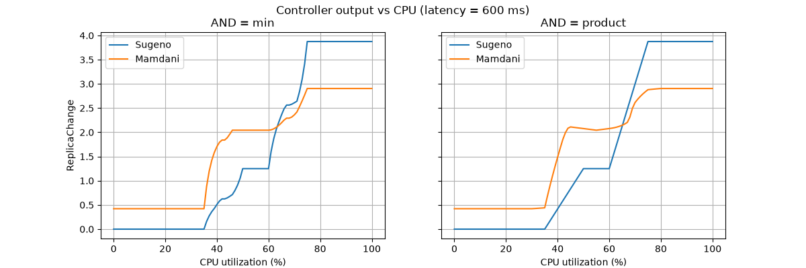

# Лабораторна робота №3. Нечіткий контролер автомасштабування K8s (Варіант 4)

## Результати

Тест-кейс: `CPU = 70 %`, `Latency = 600 мс`.

| Алгоритм виводу | ReplicaChange | Активні правила | Час виводу (мс) | Пам'ять (КБ) |
|---|---|---|---|---|
| Mamdani Inference | 2.36 | 4 правила | 0.7847 мс | 8.77 КБ |
| Takagi-Sugeno (TSK) | 2.61 | 4 правила | 0.0011 мс | 0.07 КБ |

## Інтерпретація

- **Рішення контролера.** При CPU 70 % і затримці 600 мс обидва алгоритми рекомендують додати 2–3 репліки (після округлення: Mamdani → +2, Sugeno → +3). 
Розбіжність лише 0,25 репліки, тож рішення узгоджені.
- **Активні правила.** Спрацювали 4 правила: `Medium/Medium`, `Medium/High`, `High/Medium`, `High/High`. 
Ступені належності: CPU = 70 → Medium 0.25, High 0.50; Latency = 600 → Medium 0.20, High 0.33.
- **Перевірка Sugeno вручну.** Ваги за `min`: 0.20, 0.25, 0.20, 0.33 з висновками 0, 2, 2, 5. Зважене середнє: (0 + 0.5 + 0.4 + 1.67) / 0.983 ≈ 2.61, що збігається з виводом програми.
- **Швидкодія.** Sugeno швидший за Mamdani приблизно у 700 разів (0,0011 мс проти 0,7847 мс).
- **Пам'ять.** Sugeno використовує приблизно у 125 разів менше пікової пам'яті (0,07 КБ проти 8,77 КБ).
- **Причина різниці.** Mamdani виконує акумуляцію усічених множин і чисельну дефазифікацію центром ваги, а Sugeno зводиться до зваженого середнього кількох чисел.

## Висновки

### 1. Обґрунтування вибору функцій належності

- **Крайні терми входів (Low, High) — трапеції.** `CPU Low = [0, 0, 30, 50]` і `High = [60, 80, 100, 100]`, `Latency Low = [10, 10, 100, 250]` і `High = [500, 800, 1000, 1000]`. 
Плато з μ = 1 на межах діапазону означає, що при CPU 0–30 % або 80–100 %, як і при затримці до 100 мс або від 800 мс, система однозначно належить до крайнього терму, без «дрижання» рішення.
- **Середні терми входів (Medium) — трикутники.** `CPU Medium = [35, 55, 75]`, `Latency Medium = [150, 400, 650]`. 
Режим «нормального навантаження» має одну типову точку (55 % і 400 мс), а лінійні схили забезпечують плавний перехід до сусідніх термів.
- **Вихід `ReplicaChange` (діапазон −3…+5).** `Down` і `UpBig` — трапеції з плато на краях діапазону (`[-3, -3, -1, 0]` і `[2, 5, 5, 5]`), 
`Hold = [-1, 0, 2]` і `UpSmall = [0, 2, 5]` — трикутники з піками в 0 і +2 реплік. 
Асиметричний діапазон і розташування термів відображають інженерну мету: масштабувати вгору швидше й сильніше (до +5), ніж вниз (до −3), щоб захистити SLA при сплесках трафіку.
- **Чому не гаусові.** Трикутні й трапецієподібні МФ обчислюються кількома арифметичними операціями без `exp`, що важливо для швидкодії, а перекриття термів легко контролювати параметрами.
- **Застереження щодо центру ваги.** Через плато на краях виходу Mamdani не може видати точно +5 або −3: центроїд `UpBig` лежить лівіше за 5, а `Down` дає приблизно −1,7. 
Sugeno з константами 5 і −2 досягає крайніх значень повністю.

### 2. Повнота та несуперечливість бази правил

**Повнота.**

- Входи покриті без «дір»: кожне значення CPU 0–100 % та Latency 10–1000 мс належить хоча б одному терму з μ > 0. 
Найменше перекриття на ділянці CPU 50–60 %, де діє лише `Medium` (μ ≥ 0.75), і Latency на межах 250 та 650 мс (μ сусіднього терму 0.4 і 0.5).
- Вихід теж покриває весь діапазон −3…+5.
- База містить 9 правил, тобто повну решітку 3 × 3 (усі комбінації термів CPU і Latency). Для будь-якої точки входів активується щонайменше одне правило.

| CPU \ Latency | Low | Medium | High |
|---|---|---|---|
| **Low** | Down (−2) | Hold (0) | Hold (0) |
| **Medium** | Down (−1) | Hold (0) | UpSmall (2) |
| **High** | Hold (0) | UpSmall (2) | UpBig (5) |

**Несуперечливість.**

- Усі 9 умов унікальні, немає правил з однаковою умовою та різними висновками.
- База монотонна: у кожному рядку й стовпці висновок не зменшується зі зростанням CPU або Latency (Down → Hold → UpSmall → UpBig). 
Це відповідає фізичному змісту: більше навантаження дає більше реплік.
- Неочевидні, але обґрунтовані правила: `High CPU + Low Latency → Hold` (сервіс справляється, масштабування не потрібне) та `Low CPU + High Latency → Hold` (затримка не спричинена CPU, зменшувати репліки небезпечно).
- Пара `Low/Low` і `Medium/Low` має однаковий нечіткий висновок `Down`, але різні константи Sugeno (−2 і −1) -  градація, якa доступна лише Sugeno; у Mamdani ці два правила ведуть до однакового результату.

### 3. Гладкість та обчислювальна складність

- **Складність.** Mamdani потребує акумуляції та чисельного інтегрування, складність залежить від дискретизації виходу. Sugeno має складність `O(R)` за кількістю правил. 
Вимірювання це підтверджують: 0,7847 мс проти 0,0011 мс і 8,77 КБ проти 0,07 КБ.
- **Гладкість.** Обидва виводи дають безперервну залежність від входів, бо терми перекриваються. Mamdani із центром ваги зазвичай плавніший, а Sugeno залежить від різниці констант сусідніх правил (тут до 3 реплік між `UpSmall` і `UpBig`).

**Порівняння масштабування та усічення за мінімумом (графік, `Latency = 600 мс`).** Для обох t-норм крива має ступінчастий вигляд, але з масштабуванням вона помітно плавніша. 
Із усіченням стрибки різкіші й з'являються додаткові короткі «полички» всередині зон росту.
Масштабування (добуток) дає плавніший результат, ніж усічення за мінімумом.

Структура кривої (значення Sugeno, розраховані за yaml; Mamdani має аналогічну форму):

| CPU, % | Активні терми CPU | Вихід |
|---|---|---|
| 0–35 | лише Low | 0 (плато) |
| 35–50 | Low + Medium | зростання 0 → 1,25 |
| 50–60 | лише Medium | 1,25 (плато) |
| 60–75 | Medium + High | зростання 1,25 → 3,875 |
| 75–100 | лише High | 3,875 (плато) |

### 4. Придатність для роботи в реальному часі

Час виводу 0,0011–0,78 мс і до 9 КБ пам'яті на 4–7 порядків менші за типовий період керування HPA (≈15 с), тому обидва алгоритми придатні. 
Вихід слід округлювати до цілого й за потреби додати гістерезис проти «флаппінгу».

## Підсумок

Обидва алгоритми дають близький результат (2.36 vs 2.61). Для підтримки SLA при сплесках трафіку доцільніший Sugeno завдяки швидкодії та малим витратам пам'яті, а Mamdani краще підходить для інтерпретації рішень.